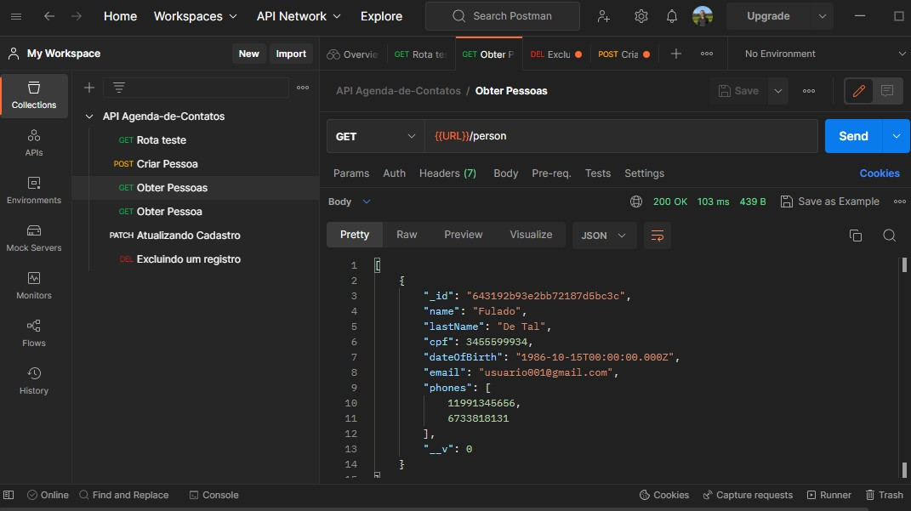

# AGENDA DE CONTATOS
> Descrição: API simples, para gravar, atualizar, recuperar e excluir contatos de agenda, contendo:

Dados pessoais
 - Nome, Sobrenome, CPF, Data de nascimento, E-mail e Telefone(s);
 
#INSTRUÇÕES
1 Está API está pronta para ser reutilizada! Portanto, será necessário ter uma conta no <a href="https://www.mongodb.com/atlas" target="_blank">MongoDB Atlas</a>, onde será manipulado os dados.
2 Clone o repositório e execute o comando "npm install" para receber as dependencias.
3 Crie o arquivo ".env" na raiz do projeto e configure as variáveis "BD_USER=?? , BD_PASSWORD=??
BD_HOST=localhost, BD_PORT=3000".
4 Tudo pronto, execute o comando "npm start".
Observação: a API envia e recebe Json, se sentir-se confortável recomendo <a href="https://www.postman.com/">Postman</a>.

# TECNOLOGIAS E CONCEITOS UTILIZADOS:
- Javasript
- NodeJS
- Express
- ODM Mongoose
- MongoDB Atlas
- Orientação a objetos
- Boas práticas

Created with ❤ by Felipe
